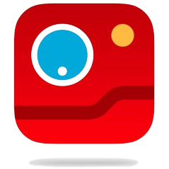

<!-- Improved compatibility of back to top link: See: https://github.com/othneildrew/Best-README-Template/pull/73 -->

<!-- PROJECT SHIELDS -->
<!--
*** I'm using markdown "reference style" links for readability.
*** Reference links are enclosed in brackets [ ] instead of parentheses ( ).
*** See the bottom of this document for the declaration of the reference variables
*** for contributors-url, forks-url, etc. This is an optional, concise syntax you may use.
*** https://www.markdownguide.org/basic-syntax/#reference-style-links
-->
[![GPL-3 License][license-shield]][license-url]
[![LinkedIn][linkedin-shield]][linkedin-url]
[![Android][android-shield]][android-url]

<!-- PROJECT LOGO -->
 

  

<h3 align="center">Pokedéx</h3>

  

    A basic Pokedéx app that shows a list of Pokémon and also various stats, based on this Figma.
     
     
    <a href="https://github.com/DanielSouzaBertoldi/Pokedex/issues">Report Bug</a>
    ·
    <a href="https://github.com/DanielSouzaBertoldi/Pokedex/issues">Request Feature</a>
  

<!-- TABLE OF CONTENTS -->

  
Table of Contents

  <ol>
    <li>
      <a href="#about-the-project">About The Project</a>
      <ul>
        <li><a href="#built-with">Built With</a></li>
      </ul>
    </li>
    <li>
      <a href="#getting-started">Getting Started</a>
      <ul>
        <li><a href="#prerequisites">Prerequisites</a></li>
      </ul>
    </li>
    <li><a href="#usage">Screens</a></li>
    <li><a href="#roadmap">Roadmap</a></li>
    <li><a href="#license">License</a></li>
    <li><a href="#contact">Contact</a></li>
  </ol>

<!-- ABOUT THE PROJECT -->
## About The Project

[![Pokedex Video][product-video]](https://github.com/DanielSouzaBertoldi/Pokedex/)

A basic Pokedéx app that shows a list of Pokémon and their data, based on this [Figma](https://www.figma.com/file/THLxZSlOoUYMZrjFg0Kl1M/Pok%C3%A9dex?type=design&node-id=18241-2789&mode=design&t=F41WGriuYghVmBhW-0).
This project was built using the following frameworks and libraries:

| Context      | Libraries                              |
|--------------|----------------------------------------|
| UI           | Jetpack Compose and Accompanist        |
| Architecture | MVVM and Clean Arch                    |
| Tests        | JUnit and MockK                        |
| DI           | Dagger 2 and Hilt                      |
| Data Storage | Room and Proto DataStore               |
| Lint         | Detekt                                 |
| Network      | Retrofit with OkHTTP and Moshi         |
| Others       | Jetpack Paging/Jetpack Navigation/Coil |

I created this project with the intention of learning new libraries and applying from the ground up
what I've learned from my carreer experience. The code in some parts it's still not great, but the
app flow is done. There's a lot to do still, but I think it's a great basic showcase.

(<a href="#readme-top">back to top</a>)

### Built With

* [![AndroidStudio][AndroidStudio]][AndroidStudio-url]
* [![Kotlin][Kotlin]][Kotlin-url]
* [![Compose][Compose]][Compose-url]
* [![JUnit5][JUnit5.js]][JUnit5-url]

(<a href="#readme-top">back to top</a>)

<!-- GETTING STARTED -->
## Getting Started

Clone the project somewhere in your computer, open it up in your Android Studio then just build the 
project normally.

### Prerequisites

- Latest version of Android Studio.
- Android Device/Emulator running Android 11 or later.

(<a href="#readme-top">back to top</a>)

<!-- SCREENS -->
## Screens

### Pokémon List

https://github.com/DanielSouzaBertoldi/Pokedex/assets/28109145/c3e70fb9-abed-414d-ba92-e43a40633a14

Also known as the home of the app. It fetches data from 20 Pokémons at a time using the 
[PokéAPI](https://pokeapi.co/api/v2), then we save the necessary data in a Room database so that we 
won't need to fetch it all again.

There's also the filter options above, but currently they aren't functional.

### Pokémon Details

https://github.com/DanielSouzaBertoldi/Pokedex/assets/28109145/224d396e-d13b-4a3f-9f94-a75ebc2045bf

By clicking in a Pokémon, the apps navigates to the Pokémon Details screen. Here you can have a look
at a bunch of stats of the given Pokémon by scrolling the content within the pager and changing tabs.

(<a href="#readme-top">back to top</a>)

<!-- ROADMAP -->
## Roadmap

- [ ] Add Pokémon List Filter Logic
- [ ] Fix Pager in Pokémon Details
- [ ] Tidy up the code

(<a href="#readme-top">back to top</a>)

<!-- LICENSE -->
## License

Distributed under the GPL-3.0 License. See `LICENSE.md` for more information.

(<a href="#readme-top">back to top</a>)

<!-- CONTACT -->
## Contact

Daniel Bertoldi - [DanielSouzaBertoldi](https://github.com/DanielSouzaBertoldi) - danielbertoldi@msn.com

Project Link: [https://github.com/DanielSouzaBertoldi/Pokedex](https://github.com/DanielSouzaBertoldi/Pokedex)

(<a href="#readme-top">back to top</a>)

<!-- MARKDOWN LINKS & IMAGES -->
<!-- https://www.markdownguide.org/basic-syntax/#reference-style-links -->
[license-shield]: https://img.shields.io/github/license/DanielSouzaBertoldi/Pokedex?style=flat-square
[license-url]: https://github.com/DanielSouzaBertoldi/Pokedex/blob/main/LICENSE.md
[linkedin-shield]: https://img.shields.io/badge/-LinkedIn-black.svg?style=for-the-badge&logo=linkedin&colorB=555
[linkedin-url]: https://www.linkedin.com/in/DanielSouzaBertoldi/
[android-shield]: https://img.shields.io/badge/Android-3DDC84?style=for-the-badge&logo=android&logoColor=white
[android-url]: https://www.android.com/
[product-video]: readme_media/pokedex_sample.mov
[AndroidStudio]: https://img.shields.io/badge/Android_Studio-5383EC?style=for-the-badge&logo=androidstudio&logoColor=3DDC84
[AndroidStudio-url]: https://developer.android.com/studio
[Kotlin]: https://img.shields.io/badge/Kotlin-B72BD5?style=for-the-badge&logo=kotlin&logoColor=6858F6
[Kotlin-url]: https://kotlinlang.org/
[Compose]: https://img.shields.io/badge/Compose-63c487?style=for-the-badge&logo=jetpackcompose&logoColor=4285F4
[Compose-url]: https://developer.android.com/jetpack/compose
[JUnit5]: https://img.shields.io/badge/JUnit5-5C5C5C?style=for-the-badge&logo=junit5&logoColor=25A162
[Junit5-url]: https://junit.org/junit5/
